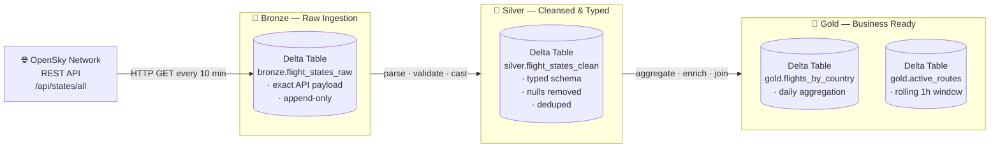

# Aviation ETL Pipeline — Databricks + Delta Lake

Portfolio project: real-time ingestion and analysis of global flight traffic using the
OpenSky Network API, built on Databricks Community Edition with a Medallion architecture.

## Business Purpose

Airlines, airports, and logistics companies need up-to-date situational awareness of
air traffic. This pipeline ingests raw flight state vectors from OpenSky Network, cleans
and enriches them through the Medallion layers, and delivers analytical-ready datasets for:

- Flight delay and congestion analysis
- Route density and utilisation mapping
- Aircraft on-ground vs. in-flight ratio reporting

---

## Architecture — Medallion Pattern



---

## Technology Stack

| Layer        | Technology                          |
|--------------|-------------------------------------|
| Compute      | Databricks Community Edition        |
| Storage      | Delta Lake (DBFS)                   |
| Processing   | Apache Spark / PySpark              |
| Language     | Python 3.x                          |
| Source API   | OpenSky Network REST API (free)     |
| Orchestration| Databricks Job Scheduler            |

---

## Project Structure

```
etl-pipeline/
├── notebooks/
│   ├── bronze/
│   │   └── 01_bronze_ingest.py       ← raw ingestion: API → Delta
│   ├── silver/
│   │   └── 02_silver_transform.py    ← cleansing, typing, dedup
│   └── gold/
│       └── 03_gold_aggregate.py      ← business-level aggregations
├── src/
│   ├── __init__.py
│   └── api_client.py                 ← OpenSky API helper (reusable)
├── tests/
│   └── test_data_quality.py          ← pytest data-quality checks
└── docs/
    └── architecture.md               ← detailed architecture notes
```

---

## Setup

### Prerequisites

- [Databricks Community Edition](https://community.cloud.databricks.com/) account (free)
- Python 3.8+
- Git

### 1. Clone the repository

```bash
git clone https://github.com/palantir00/etl-pipeline.git
cd etl-pipeline
```

### 2. Import notebooks into Databricks

1. Log in to Databricks Community Edition
2. Go to **Workspace → Import**
3. Upload the `.py` files from `notebooks/bronze/`, `notebooks/silver/`, `notebooks/gold/`
4. Attach each notebook to a running cluster (**DBR 13.x LTS** recommended)

> **Tip:** Databricks accepts `.py` files with `# Databricks notebook source` as the
> first line — no conversion needed.

### 3. Run the pipeline (in order)

| Step | Notebook | What it does |
|------|----------|--------------|
| 1 | `01_bronze_ingest.py` | Pulls live data from OpenSky → writes `bronze.flight_states_raw` |
| 2 | `02_silver_transform.py` | Cleans raw data → writes `silver.flight_states_clean` |
| 3 | `03_gold_aggregate.py` | Aggregates clean data → writes Gold tables |

### 4. Query the results

Use the **SQL Editor** in Databricks or add a cell to any notebook:

```sql
SELECT origin_country, COUNT(*) AS flights
FROM gold.flights_by_country
ORDER BY flights DESC
LIMIT 20;
```

---

## Data Source

[OpenSky Network](https://opensky-network.org/) is a non-profit association providing
open access to real-world air traffic data. The `/api/states/all` endpoint returns live
**state vectors** for all tracked aircraft worldwide — position, altitude, speed,
heading, and more.

> **Rate limits:** Anonymous access is limited to ~400 API requests/day.
> Register for a free account to get a higher quota.
